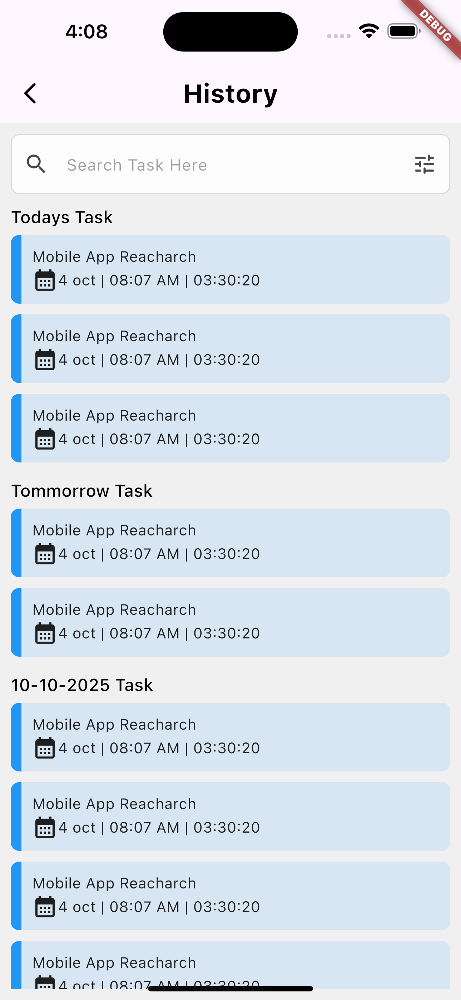
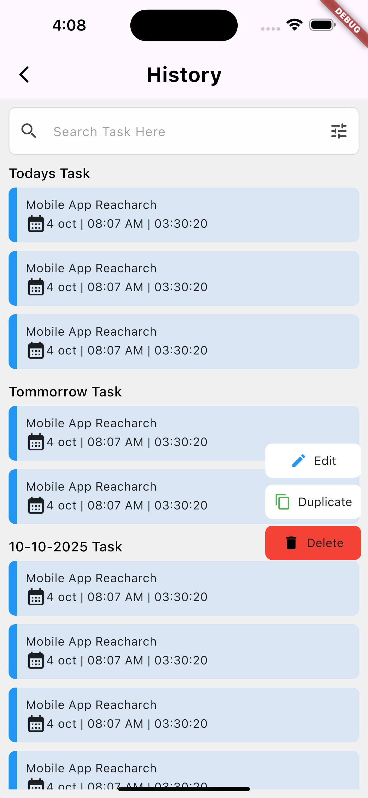
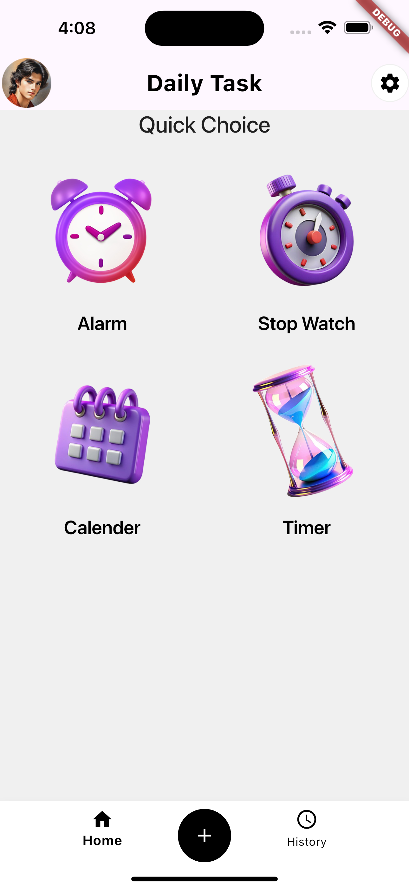
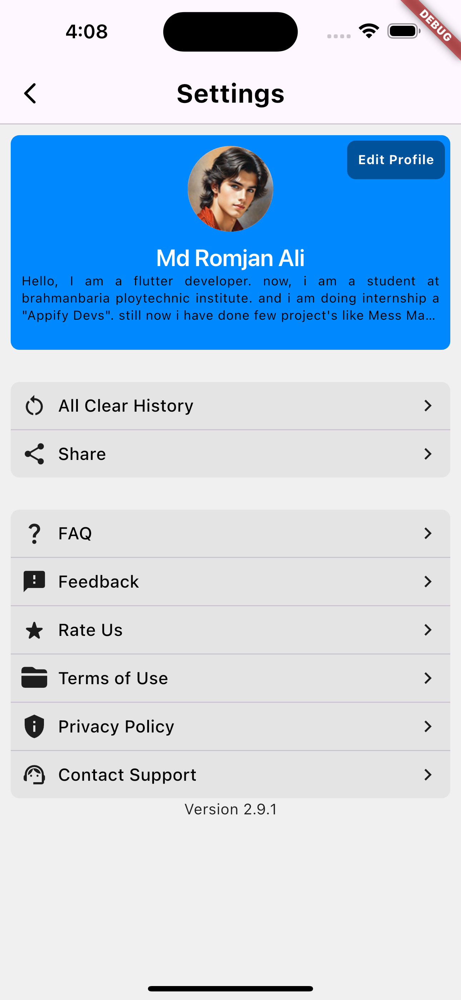
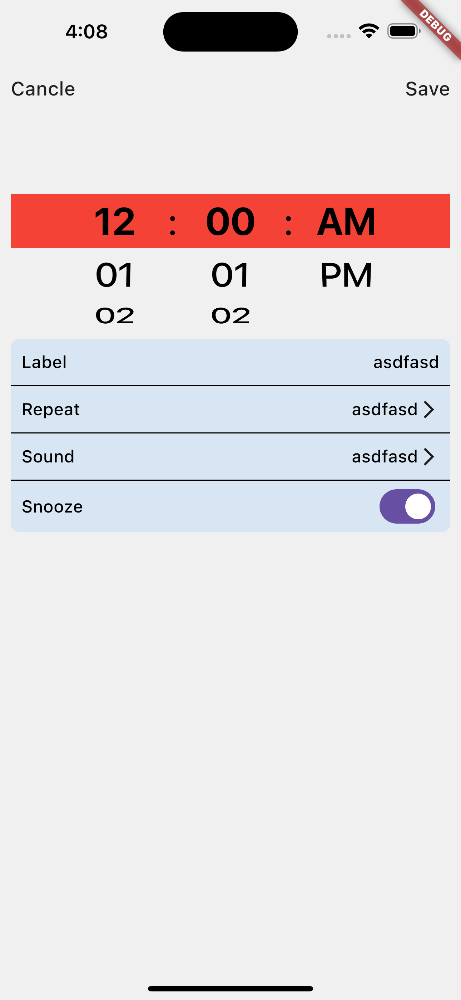
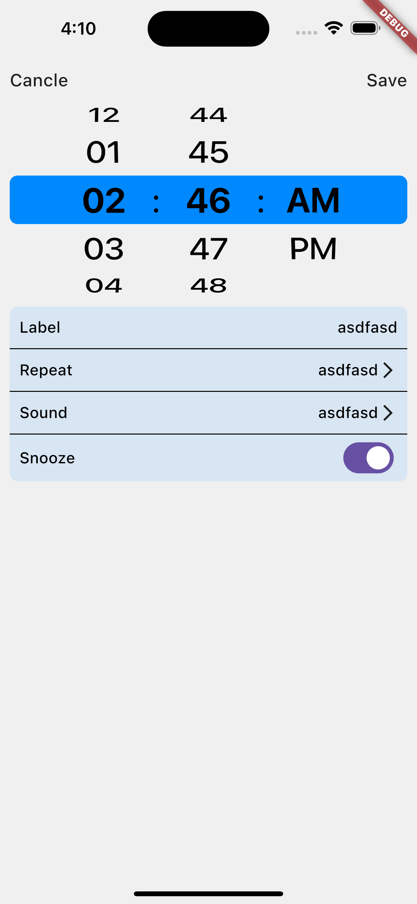

# Name: work_timer

## Note
A new Flutter project.
the project are running it's a simple overview

## Getting Started
the project is count your work time and you can see your history with title, and discreption.
## futures
with weekly and monthly bases charts.
timer, 
stopwatch, 
notification, 
alarm, 
reminder,
ETC.

